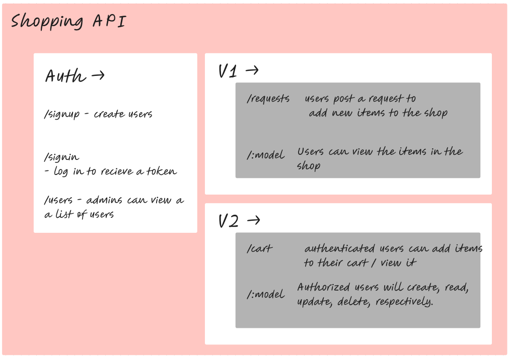

# LAB - Class 09

## Project: Shop API

### Author: Ethan Storm Hayden Cooper

### Problem Domain

### Phase 1

implement a fully functional, authenticated and authorized API Server using the latest coding techniques.

### Phase 2

Create a shopping api and 'serve' it with inquirer in the terminal with protected and unprotected routes.

### Links and Resources

[Github Actions](https://github.com/ShadowDraco/shop-api-withAuth/actions)
[Backend deployment](https://frolic-shop-api.onrender.com)

### Collaboration

Api written with Hayden Cooper

#### `.env` requirements

Port variable (PORT)
Postgres connection url (DATABASE_URL)
Secret (SECRET)
API_URL (deployed server url)

#### How to set up the application

make sure to have pgsql installed and ready to use
clone repo, fill out env file `npm i`, then run `nodemon index.js` in the terminal
try the shopping with `npm run shop`!!

#### Routes

- Get: `/test` or `/` - to test
- Post: `/signup`, `/signin`
- Get, Post, Update, Delete: `/api/<v1/v2>/:model/:id`

#### Tests

to run tests, after `npm i`, run `npm test`

#### 

##### User Stories

- User Story 1: User Registration
As a potential customer,
I want to be able to create an account on the back-end server application,
So that I can order clothes and access other features.

- User Story 2: User Login
As a registered user,
I want to be able to log in to the back-end server application,
So that I can access my account and place orders.

- User Story 3: User Roles and Permissions
As an administrator,
I want to assign roles and permissions to users,
So that I can control their access to the database and application functionality.

- User Story 4: Order Placement
As a customer,
I want to be able to place orders for clothes through the back-end server application,
So that I can purchase the items I desire.

- User Story 5: Item Request
As a customer,
I want to be able to request new items that are not currently available in the store,
So that I can purchase a broader range of clothes.
